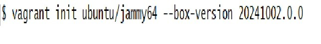
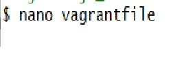
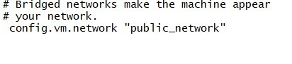
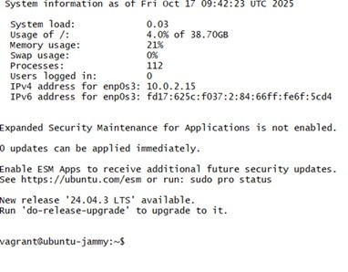
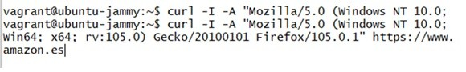
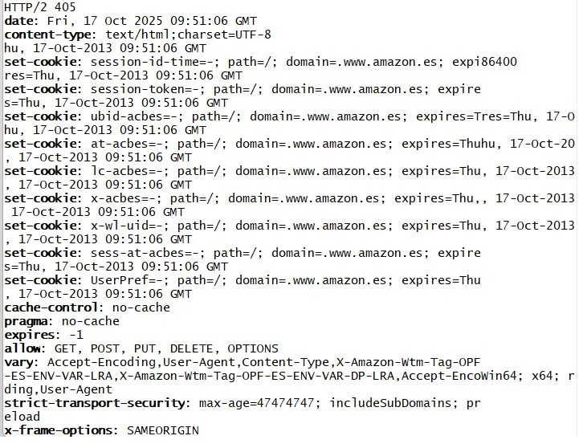
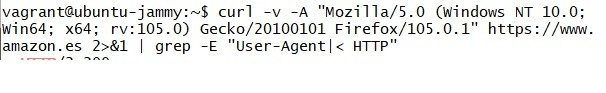
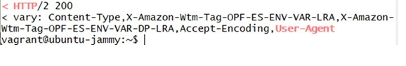

# TAREA 1 - EJERCICIO 2
## Obtén las cabeceras de una petición GET a amazon.es pero disfrazando el user-agent para parecer un Firefox versión 105.0.1.

Asumimos que toda persona que lea esta documentación ya ha realizado los pasos previos, por lo tanto, una vez hayamos descargado *Vagrant* y *VirtualBox* comenzamos con el siguiente ejercicio.

## Pasos a seguir
1. 
Primero de todo comenzamos generando un archivo base con el siguiente comando:

2. 
Debemos de modificar el archivo vagrantfila, lo cual haremos con "*nano vagrantfile*" que nos permite acceder al archivo y modificarlo.

Una vez dentro de éste, eliminaremos una de las almohadillas para habilitar la siguiente línea:

(Se muestra a modo de ejemplo el como se encuentran otras líneas con su respectiba almohadilla y la línea donde ha sido ésta eliminada)

3. 
Ahora, corremos vagrant con "*vagrant up*" y entramos dentro de vagrant con "*vagrant ssh*", cuando entremos nos mostrará un mensaje de bienvenida para hacernos notar que estamos dentro.

4. 
Una vez dentro de vagrant, lanzamos este comando para traer el get de amazon.es, lo hacemos con "-i" para no descargar toda la pagina y utilizamos también "-a" junto con el entrecomillado para "disfrazarnos" de mozilla firefoz.

5. 
Hasta aquí deberia de ser todo correcto, lo que ocurre que nos hemos encontrado con un inconveniente; amazon si ha reconocido nuestro "disfraz" de firefox pero no nos ha devuelto un codigo 200, por lo que vamos a continuar hasta conseguirlo.

6. 
Optamos por el siguiente comando:

Donde decidimos cambiar a "**-v**" para que muestre toda la comunicación de red, incluyendo las cabeceras de la petición enviada y la respuesta recibida. También añadimos  "**2>&1 | grep -E ...**" 

Los mensajes que queremos obtener (los de HEAD)son filtradas de manera que recivimos las que aparecza el "user-agent" o que contenga la secuencia de HTTP (que es donde comienzan las cabeceras).

Así, conseguimos el codigo 200:

De esta manera concluimos de forma exitosa con la optención de las cabeceras de amazon.es de una petición GET con nuestro disfraz reconocido por este.