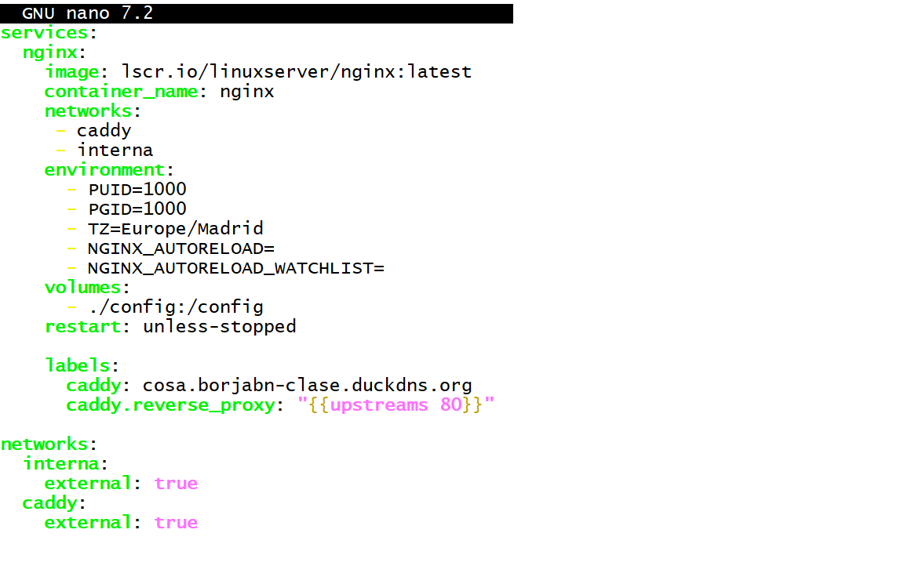

# Documentación de examen UT3 y UT4

## Apartado nº 1
Vamos a levantar un contenedor de docker donde nos mostrará nuestro nombre nombre completo al llamarlo con ***curl***.

1- Comenzamos creando un direcotrio al que llamaremos *"apartado1"*, accedemos con el comando **cd apartador1**  y procedemos a crear el contenedor.

2- Lanzamos el comando **sudo docker run -d -p 8090:80 --name examen2Ap1 httpd:latest**
donde:

- "*sudo docker run -d*": sería apra lanzar el contenedor y en segundo plano

- "*-p 8090:80*": para indicar los puertos, donde el primero es el del host (nuestro ordenador físico) y el segundo el puerto del propio contenedor.

- "*--name examen2Ap1*": el nombre que le damos al contenedor 

- "*httpd:latest*": la imagen de apache que vamos a utilizar(la última).

3- Para que funcionen los puertos nuevos en la isntancia, vamos ha habilitarlos en el grupo de seguridad:

- Dentro de la instancia buscamos el apartadod e seguridad, entramos dentro de "Grupos de Seguridad"

- Entramos dentro de "editar reglas entrada" y "agregar regla" donde pondremos los datos pertinentes (TCP: personalizado, puerto 8090 y acceso desde 0.0.0.0/0)

4- Continuamos desde la terminal ahora con **echo'\<!DOCUTYPE html>\<html>\<head>\<title>Hola Borja De La Cruz Lucio\</title>\</head>\<h1>Hola Borja De La Cruz Lucio\</h1>\</body>\</html>'**:

5- Continuamos con el comando **sudo docker cp index.html examen2Ap1:/usr/local/apache2/htdocs/index.html**:

- De esta forma cambiariamos el contenido del index.html que trae por defecto apache donde nos muestra un "it's work" por "Borja De La Cruz Lucio".

6- Por ultimo, mostramos el contenido de la "página creada" con **curl http://100.27.201.17:8090 **

- Nos muestra un "*\<!DOCUTYPE html>\<html>\<head>\<title>Hola Borja De La Cruz Lucio\</title>\</head>\<h1>Hola Borja De La Cruz Lucio\</h1>\</body>\</html>'*"

## Apartado nº 2

1- Comenzamos creando un directorio con el nombre de *"apartado2*", donde vamos a acceder y crear un contenedor con un .yml.

2- Aprovechando los contenedores ya creados durante las prácticas de clase, vamos a modificar el compose.yml de nginx donde está delcarado el dominio a utilizar (borjabn-clase.duckdns.org) donde se verá modifcado añadiendole cosa. quedando "*cosa.borjabn-clas.duckdns.org*"

3-  Levantamos el contenedor con el comando **docker compose up -d** para hacerlo en segundo plano

## Apartado nº 4
En el siguiente apartado vamos hacer una monitorización de los contenedores ya creados durante las prácticas de clase, dentro del directorio uptime se creo un .yml con el contenido de *"louislam/uptime-kuma"*, se levanta con docker compose up -d y accedemos con :
ssh -i labsuser.pem -ND 9999 ubuntu@borjabn-clase.duckdns.org