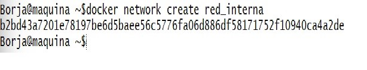
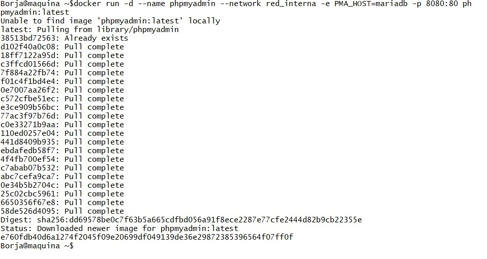

# TAREA 2 - EJERCICIO 1
## Descripcion
En esta taréa se ha procedido a la creacion de un conjunto de microservicios (con docker) compuesto por 3 contenedores:

- Se debe de crear una red interna para la comunicación entre contenedores.

- Microservicio *mariaDB* noa ccesible desde el mundo, sólo desde la red interna. Éste debe inicializarse con la creación del usuario "*pepe*" y como contraseña "*despliegue*".

- Microservicio *php-apache* que pueda acceder a la bbdd y desde el eterior en el puerto 80. Debe contener un "*phpinfo()*" en el archivo "*info.php*" de la raíz pública.

- Microservicio *phpMyAdmin* que pueda acceder a la bbdd y sea accesible desde el exterior en el puerto 8080.

## 1. Pirmeros pasos

### A) Creación de la red interna
Asumimos que ya está creada una maquina de vagrant basada en ubuntu con docker descargado.

Al entrar dentro de la maquina de vagrant (con el comando "*vagrant ssh*"), comenzaremos a crear primero la red interna de la que haremos uso durante la práctica

Con este comando hemos creado la red interna, asignándole el mismo nombre (así sabremos cual es en caso de haber otra)

### B) Microservicio mariaDB

Se va a crear dicho contenedor para que sea solo accesible a través de la propia red interna:

Con este comando le asignamos un nombre (mariadb), la conectamos con la red interna para que solo los contenedores de esta red puedan "hablar entre ellos", al poner solo este acceso no se puede acceder directamente al contenedor.

Por otra parte, le indicamos que cree de forma automática una base de datos llamada "*appdb*" al arrancar por primera vez, a la que accederemos con el usuario pepe y la contraseña despliegue.

### C) Microservicio php-apache

Continuamos con la creación del contenedor php que pueda acceder a la base de datos a través de la red interna y esté conectado al puerto 80 para poder conectar con el exterior.

De esta manera creamos el contenedor nombrándolo como "*php-apache*" y lo conectamos con la red interna para conectarlo a su vez con "*mariadb*", que esté público con el puerto 80 y le damos un volumen.

### D) Microservicio phpMyAdmin

Pasamos a crear el contenedor de phpmyadmin que pueda acceder a la base de datos y sea accesible desde el puerto 8080.

Con este comando creamos el contenedor y le damos el nombre de "*phpmyadmin*", lo conectamos con la red interna y al puerto 8080 con el 80

---

Aqui podemos ver como están levantados los tres contenedores

Y aquí comprobamos las ip's para poder acceder desde el navegador ->

Se demuestra que se puede acceder desde el navegador con la ip a myAdmin y entramos con el el usuario pepe y la contraseña despliegue:

Aquí se demuestra que se ha podido entrar.

De esta manera completamos la tarea con exito. Todos los comandos han sido añadidos al vagrantfile para que se pueda lanzar y estar listo en un momento.