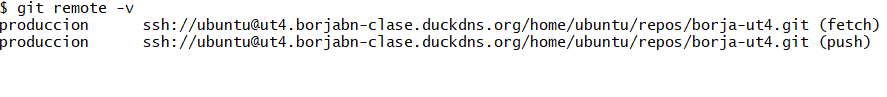
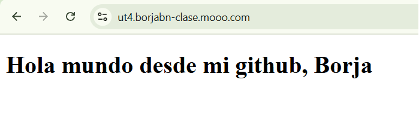

# UT4 SERVIDORES DE APLICACIONES

En este documento se encuentra los pasos a seguir para completar de manera correcta la actividad de GitBare de la unidad de trabajo 4. 

"***Vamos a crear nuestro propio Git Hub***"

## 1. Despliegue con Git.

Los primeros pasos segudios en esta actividad están indicados de una manera muy clara en el siguiente enlace:

[Enlace facilitado para completar la tarea](https://hardfloat.es//blog/2021/03/23/desplegar-aplicaciones-con-git.html)

Aquí a continuación se redacta de manera similar el contenido de dicho enlace.

### 1.1. Primeros pasos

Se comienza con la creación de y configuración del servidor, creando primero de todo el repositorio *git bare* en la instancia:

<pre>
    git init --bare nombreRepo.git
</pre>

Con este comando se crea un repositorio bare con el nombre que se le quiera dar a dicho repositorio.

Se contiua con la creación del directorio de trabajo (se le puede poner cualquier nombre, no es necesario que tenga el mismo nombre que el .git).

### 1.2. Creación de Hook

Se comienza entrando en el .git, donde se pueden ver varios directorios, el que interesa es el directorio "*hooks*". Una vez dentro de este se crea el archivo post-recive.

<pre>
nano post-receive
</pre>
 Donde se le añade el siguiente contenido:

<pre>
#!/bin/bash

GIT_DIR=/home/ubuntu/repos/borja-ut4.git
GIT_WORK_TREE=/home/ubuntu/repos/borja-ut4

# Crear carpeta de trabajo si no existe
if [ ! -d "$GIT_WORK_TREE" ]; then
    mkdir -p "$GIT_WORK_TREE"
fi

# Actualizar el código desde la rama main
git --git-dir="$GIT_DIR" --work-tree="$GIT_WORK_TREE" checkout -f main

# Entrar en la carpeta de trabajo
cd "$GIT_WORK_TREE"

# Reiniciar contenedores Docker
docker compose down
docker compose up -d
</pre>

El script viene dentro del enlace dado al principio, lo único que éste ha sido modificado a las características personales de este proyecto.

*(nota personal: la parte de los submodulos la he eliminado porque no estoy comodo creadno proyectos de git dentro de otros proyectos de git. 
Con estas modificaciones está para trabajar como lo has estado haciendo hasta ahora. 
Ojo: si se utiliza de nuevo el script base, acordarse de cambiar los comandos de docker-compose viejos)*

A continuación es necesario darle permisos de ejecución al hook

<pre>
chmod +x post-receive
</pre>

Con este permiso se consigue que el archivo no sea un mero texto, el archivo pasa a ser reconocido por el sistema como un programa ejecutable. 

*(nota personal: es básicamente por la x, es como r de read y w de write, pueste es x de eXecute)*

### 1.3. Configuración de el remoto

Se ha creado un directorio a parte para tener de ejemplo con esta práctica.

Dentro de dicho directorio se ejecuta el siguiente comando:

<pre>
git remote add produccion ssh://ubuntu@ut4.borjabn-clase.duckdns.org/ruta/de/donde/se/tiene/el/.git
</pre>

Para comprobar que todo ha está bien, es recomendable hacer "***git remote -v***"

Con esto se puede ver que el repositorio creado en local está conectado al remoto correctamente.

### 1.4. Hacer el primer commit

Se añade todo el material creado de ejemplo y se hace un commit con mensje, como en github normal (git init, git add, git commit -m"")

<pre>
git push nombre main (o master, dependiendo de la rama)
</pre>

De esta manera si todo está bien, se subirá el contenido de la carpeta local a la carpeta (con al ruta dicha en el hook) de la instancia.

### 1.5. Creación del compose.yml

Dicho archivo se ha creado en el directorio local, de manera que al subirlo, mediante el hook, se lanza y levanta solo.

<pre>
version: "3.8"

services:
  web:
    image: nginx:alpine
    ports:
      - "8080:80"
    volumes:
      - ./index.html:/usr/share/nginx/html/index.html
    networks:
      - caddy
    labels:
      caddy: ut4.borjabn-clase.duckdns.org, ut4.borjabn-clase.mooo.com
      caddy.reverse_proxy: "{{upstreams 80}}"

networks:
  interna:
    external: true
  caddy:
    external: true
</pre>

*(Nota personal: asegurarse siempre de que el dominio esté bien escrito, hubo problemas por no escribirlo bien aquí en el compose. Copiado de nginx ya hecho anteriormente, modificado para que tenga los datos necesarios ahora)*

*(Nota personal: aunque lo levante el hook, no lo detecta de primera la red ni caddy, reiniciar el contenedor y si no lo ha reconocido todavía, reinicia la red y el caddy, así ha funcionado 100%)*

[Encale donde ver el resultado](https://ut4.borjabn-clase.mooo.com/)