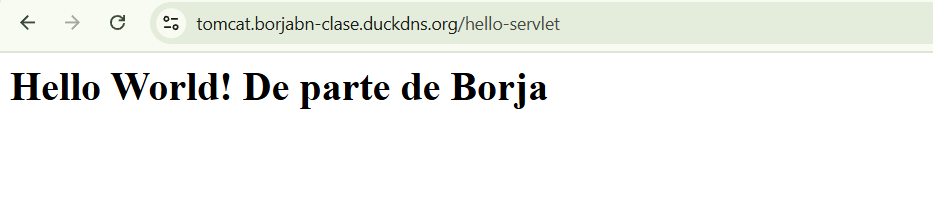
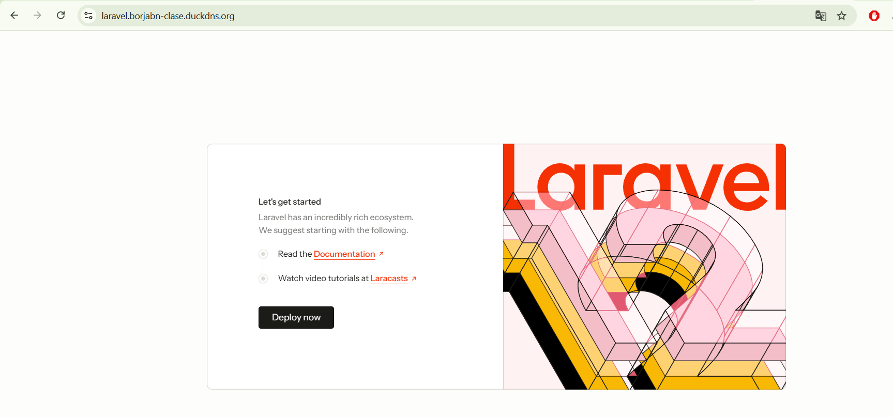
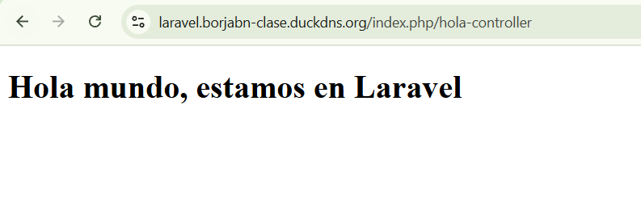
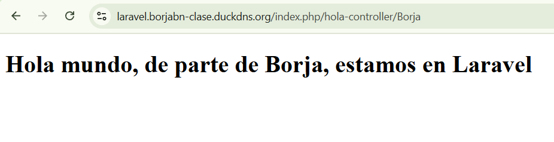
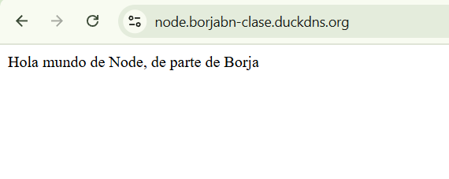
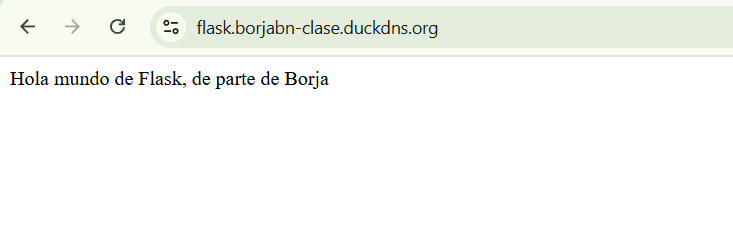

# UT4 SERVIDORES DE APLICACIONES

En este documento se encuentra los pasos a seguir para completar de manera correcta las actividades obligatorias de unidad de trabajo 4.

## 1. Despliegue de tomcat

En la siguiente actividad se va a crear un crear un proyecto JakartaEE con un Hola Mundo y lo se va a despleguar en la instancia EC2 a través de un servidor tomcat que se ha creado para dicha tarea.

### 1.1. Crear una aplicación echo en JakartaEE

Con Intellij Idea se crea un proyecto JakartaEE donde al momento de crearlo aparece un "Hola Mundo" a modo de ejemplo; en este caso se ha modificado el texto que aparecerá para hacerlo más personal y sea fácil de identificar quien es el propietario.

Se continua con la creación del archivo .war con el siguiente orden de pasos:

    1- Dentro del propio proyecto se accede a "build".
    2- Se accede a la opción de "build artifacts"
    3- Hacer click sobre "'nombre'.war" en lugar de "'nombre'.war exploded".
    4- Hacer click sobre build (No es necesario pero es recomendable hacer primero un "clear" antes del "build").

De esta manera se crea un directorio nuevo en el proyecto llamado "target", aquí es donde se guardan los archivos .war.

### 1.2. Levantar un servidor Tomcat

Se procede a crear el servidor tomcat dentro de la instancia EC2 con un script que se ha facilitado para dicha tarea, de esta forma lo unico que se ha hecho ha sido modificar los nombres de las redes a utilizar donde se indica, copiar y pegar. 

Quedando:

<pre>  
services:  
  tomcat:  
    image: tomcat:10  
    container_name: tomcat  
# Para probar vía proxy socks (filtrado en el firewall de AWS)  
    ports:  
      - 8888:8080  
    volumes:  
# Dir de despliegue de aplicaciones.  
#   Poner aquí los war y los auto-despliega (descomprime)  
      - ./aplicaciones:/usr/local/tomcat/webapps  

# CORS global (para una app concreta insertar el filtro en el web.xml del direorio META-INF)  
      # -/web.xml:/usr/local/tomcat/conf/web.xml  

# La red "red_interna" es para conectar con una bbdd sin exponerla a la red "global" del proxy inverso "red_de>  
    networks:  
      - caddy #red_de_proxy  
      - interna #red_interna  
    labels:  
      caddy: tomcat.borjabn-clase.duckdns.org  
      caddy.reverse_proxy: "{{upstreams 8080}}"  

networks:  
   caddy:  
      external: 'true'  
   interna:  
      external: 'true'  
</pre>

Se levanta el contenedor y se continua con el siguiente punto.

### 1.3. Desplegarla en tomcat.tudominio.duckdns.org

Una vez hecho todo lo anterior, se ha copiado manualmente (con un copia y pega) el archivo .war (un ejemplo de como sería la ruta de las carpetas donde encontrar el .war"***C:\Users\Borja\IdeaProjects\borja\target***") dentro de la maquina virtual que se tiene conectada a la EC2 (Hecho en actividades anteriores; conectada mediante ssh).

Para comprobar que realmente se ha hecho bien, se hace uso del siguiente comando:

<pre>
  ls -l /vagrant
</pre>

Llegados hasta este punto, lo que se hace ahora es pasar el archivo .war de la maquina vagrant a la instancia EC2 mediante:

<pre>
rsync -avz -e "ssh -i ~/.ssh/nombre_llave.pem" /vagrant/nombre_archivo.war ubuntu@nombre_dominio_para_acceder_a_instancia:/home/ubuntu/
</pre>

Haciendo uso de la llave de ala instancia y rsync , se pasa el archivo a la instancia:

<pre>
rsync -avz -e "ssh -i ~/.ssh/nombre_llave.pem" /vagrant/nombre_archivo.war ubuntu@nombre_dominio_para_acceder_a_instancia:/home/ubuntu/
</pre>

Ahora se procede a colocarlo en su directorio correspondiente, llamado "**tomcat/aplicaicones**", con el comando:

<pre>
 mv nombreArchivo.war tomcat/aplicaciones/
</pre>


De esta manera ya se podría acceder al contenido del .war, lo único que sería a través de la url "***https://tomcat.borjabn-clase.duckdns.org/borja-1.0-SNAPSHOT/hello-servlet***"; pero para completar la tarea con el 100% de exito, se debe de acceder directamente desde "***https://tomcat.borjabn-clase.duckdns.org/nombre_archivo***", por lo que se debe de cambiar el nombre del archivo a "*ROOT.war*".

Se repite la subida del archivo a la mv y al instancia; no se ha encontrado conflictos pero por si acaso, para futuro se ha decidio eliminar el .war anterior. Con el sigueinte comando:

<pre>
 rm -rf ~/tomcat/aplicaciones/borja-1.0-SNAPSHOT

 rm -rf ~/tomcat/aplicaciones/borja-1.0-SNAPSHOT.war
</pre>

Después de esto se relanza el servidor tomcat, ahora ya se tiene el objetivo completo:





---


## 2. Hola Mundo en Laravel

En la siguiente actividad se va a crear un crear un Hola Mundo  en Laravel y luego se va a despleguar en la instancia EC2 gracias a una imagen de dockerhub "***llamada shinsenter/laravel***", ya que la imagen de dada como ayuda para realizar dicha práctica se ha convertido en imagen de pago.

| URL del resultado de la práctica |
|----------------------------------|
| https://laravel.borjabn-clase.duckdns.org/index.php/hola-controller |
| https://laravel.borjabn-clase.duckdns.org/index.php/hola-controller/nombre |


### 2.1. Levantar el contenedor de laravel

Como la imagen recomendada para la práctica actualmente es de pago, se ha decidico hacer uso de otra imagen de dockerhub (shinsenter/laravel):

[Enlace de la imagen de shinsenter/laravel](https://hub.docker.com/r/shinsenter/laravel)

De aquí se ha sacado la información necesaria para hacer el compose.yml, el cual ha quedado tal que así:

<pre>
version: "3.9"

services:
  laravel:
    image: shinsenter/laravel:latest
    container_name: laravel-app
    volumes:
      - ./proyectoLaravel:/var/www/html
    networks:
      - caddy
    labels:
      caddy: laravel.borjabn-clase.duckdns.org
      caddy.reverse_proxy: "{{upstreams 80}}"
    restart: unless-stopped
    # Acordarse que esto está imparable, hay que tirarlo manualmente para pararlo
networks:
  caddy:
    external: true   
</pre>

Antes de levantar el contenedor se debe de crear el directorio "***proyectoLaravel***", para que cuando se levante el contenedor este verá vacío el direcotrio y descargará en éste Laravel.

*Anotación personal: Se ha encontrado prblemas con que no se detectaba el contenedor por parte de caddy, por lo que para solucionar dicho error se ha decidido reiniciar caddy; de esta manera se ha solucionado el error. (Recordatorio también a futuro, adoptar esta acción como "buena práctica")*

De esta forma, si todo ha salido bien, ya veremos "algo" al acceder a "***https://laravel.borjabn-clase.duckdns.org/***", veremos algo tal que así:




### 2.2. Creación de clave segura

Es necesario crear una clave segura para la aplicación de Laravel, que Laravel utilizará para cifrar "ciertas cosas".

Así pues, lo primero que hay que hacer con cualquier aplicación Laravel nueva es ejecutar este comando:

<pre>
  docker exec nombreContenedor php artisan key:generate
</pre>

De esta forma se le ordena a docker que entre dentro del contenedor (en este caso laravel-app) y ejecute el comando "***php artisan key:generate***" para generar una clave segura dentro del archivo .env.

*Anotación personal: para comprobar que todo está correcto, se entra dentro del contenedor con "docker exec -it laravel-app bash" y se entra dentro del propio contenedor. Ya dentro del contenedor hacer un "cat o nano .env" (dependiendo de la imagen puede traer instalado o no el comando nano); con estos pasos se puede observar perfectamente el APP_KEY*


### 2.3. Modificación del enrutador

A continuación, se procede modifica el archivo **/routes/web.php** del interior del contenedor y se le añade:

<pre>
  Route::get('/hola', function() {
    return "Hola mundo, de parte de Borja, estamos en Laravel";
  });
</pre>

De esta manera ya se podría ver el mensaje al entrar en "***https://laravel.borjabn-clase.duckdns.org/index.php/hola***"

### 2.4. Creación del controlador

Lo que suele hacer en enrutador es redirigir la ejecución hacia un controlador, por lo que se procede a crear un controlador que gestione la lógica de la ruta. Se utiliza el siguiente comando:

<pre>
  php artisan make:controller HolaController (dentro del contenedor)

  docker exec laravel-app php artisan make:controller HolaController (fuera del contendor)
</pre>

Después de crearlo se modifica con:

<pre>
  nano app/Http/Controllers/HolaController.php
</pre>

Dejando el controlador tal que así

<pre>
(Aquí iría la etiqueta de apertura de php, pero el coumento .md no deja visualizarla)
namespace App\Http\Controllers;

use Illuminate\Http\Request;

class HolaController extends Controller
{
    public function index()
    {
        // Muestra la vista sin nombre
        return view('hola');
    }

    public function saludar($nombre)
    {
        // Pasa el nombre a la vista
        return view('hola', ['nombre' => $nombre]);
    }
}

</pre>


### 2.5. Creación de la vista

Se comienza creando el archivo de de la vista dentro del contenedor("*nano resources/views/hola.blade.php*"), dicho archivo contendrá:

```html
<!DOCTYPE html>
<html>
<head>
    <title>Hola</title>
</head>
<body>
    <h1>
        Hola mundo,
        @isset($nombre)
            de parte de {{ $nombre }},
        @endisset
        estamos en Laravel
    </h1>
</body>
</html>
```


Después de esto, se le añade las rutas al archivo web.php que apunten al controlador, dejándolo así

<pre>

use Illuminate\Support\Facades\Route;
use App\Http\Controllers\HolaController;


Route::get('/', function () {
    return view('welcome');
});

Route::get('/hola', function () {
    return "Hola mundo, de parte de Borja, estamos en Laravel";
});


Route::get('/hola-controller', [HolaController::class, 'index']);
Route::get('/hola-controller/{nombre}', [HolaController::class, 'saludar']);

</pre>


*Anotación personal: recordatorio de que el "use" debe de ir al comienzo del archivo si o si, no colocar entre medias del archivo, dará error (es como las importaciones en otros archivos)*

De esta forma se ha conseguido que al acceder a la url "***https://laravel.borjabn-clase.duckdns.org/index.php/hola-controller***" se observe el resultado deseado.



Y añadiendo al final de la url un nombre, veremos el nombre en el mensaje de la vista




---


## 3. Node.js

En la siguiente práctica se ha creado un proyecto basado en nodejs, se desplegará en la instancia EC2 pero será visible a traves de "***[node.borjabn-clase.duckdns.org](https://node.borjabn-clase.duckdns.org)***"


### 3.1. Creación de server.js

Se ha facilitado el contenido de este en la descripción de la propia práctica, por lo cual lo único que se debe de hacer es un "nano" y pegar el contenido, dejándolo tal que así:


<pre>
const express = require('express')
const app = express()
const port = 3000

app.get('/', (req, res) => {
  res.send('Hola mundo de Node, de parte de Borja')
})

app.listen(port, () => {
  console.log(`Example app listening on port ${port}`)
})

</pre>

### 3.2. Creación de alias e inicializar proyecto con npm init

Siguiendo la recomendación "para un proyecto ocasional no es necesario instalar Node", se ha hecho uso de un alias para continuar con la práctica, dicho alias se debe de copiar y pegar, para no tener que hacer esto se ha decidido modificar el archivo "*.bashrc*" añadiendo el alias, de esta manera lo único que se debe de hacer para usarlo sería invocarlo con el nombre asignado, en este caso **node**

<pre>
alias node='docker run --rm -it -u $(id -u):$(id -g) -v $(pwd):/app -w /app node:latest'
</pre>

De esta manera al hacer node node -v se deberia de ver la versión de node instalada.

A continuación se crea el **package.json** con:

<pre>
node npm init (Hará una serie de preguntas donde se debe de seleccionar las características deseadas)

node npm init -y (Marca las opciones por defecto de las preguntas)
</pre>


### 3.3. Instalacion de dependencias con npm install express

En este paso se crean el directorio "***node_modules/***", el archivo "***package-lock.json***" y añade a las dependencias "**express**" en el package.json.

<pre>
node npm install express
</pre>


### 3.4. Creación de Dockerfile

Se procede a crear la imagen con el contenido facilitado en el enunciado de dicha práctica:

<pre>
# Utiliza una imagen base de Node.js mínima
FROM node:alpine

# Establece el directorio de trabajo en el directorio raíz de la imagen
WORKDIR /usr/src/app

# Copia el package.json y el archivo lock (si lo tienes)
COPY package*.json ./

# Instala las dependencias
RUN npm install

# Copia el resto de los archivos de la aplicación
COPY . .

# Exponer el puerto 3000
EXPOSE 3000

# Comando para iniciar la aplicación
CMD [ "npm", "start" ]
#ENTRYPOINT [ "node", "server.js" ]
</pre>

### 3.5. Creación de compose.yml

Utiliando de referencia los compose.yml de ejercicios anteriores, se ha creado el compose para esta práctica con algunas modificaciones, dejándolo tal que así:


<pre>
version: "3.9"

services:
  nodeapp:
    build: .
    container_name: node-app
    networks:
      - caddy
    labels:
      caddy: node.borjabn-clase.duckdns.org
      caddy.reverse_proxy: "{{upstreams 3000}}"
    restart: unless-stopped

networks:
  caddy:
    external: true

</pre>

Se tomó como modelo el compose de laravel y se adaptó para node, cambiando el puerto, el nombre y el dominio.

Con todo esto ya se puede observar en el navegador el mensaje:



*Anotación personal: tarda en cargar, hay que ser paciente, recargar varias veces e incluso poner en paginas nuevas*


---


## 4. Flask

En la siguiente práctica se ha creado un proyecto basado en flask; se desplegará en la instancia EC2 pero será visible a traves de "***[flask.borjabn-clase.duckdns.org](https://flask.borjabn-clase.duckdns.org)***"


### 4.1. Creación de app.py

Se crea este archivo como punto de entrada para flask, es donde se encuentra la lógica de la aplicación, en este caso un "hola mundo" peronalizado. Su contenido será el facilitado para la realización de la práctica:


<pre>
# Importar librería
from flask import Flask

# Crear instancia a clase Flask
app = Flask(__name__)

# Asociar ruta a función
@app.route("/")
def hello_world():
 return "<p>Hola mundo de Flask, de parte de Borja</p>"
</pre>


### 4.2. Creación de requirements.txt

Se debe de crear antes que el Dockerfile, ya que en caso de hacerlo al reves, al levantar la imagen fallaría, porque no encontraría dicho archivo.

En este archivo se guardan las dependencias que python va a usar, por lo que su contenido para la práctica queda tal que así


<pre>
flask
</pre>

*Anotación personal: en caso de necesitar instalar una dependencia a futuro, solo se debe de añadir aquí*

### 4.3. Creación de Dockerfile

De la misma forma que con el conenido anterior, el Dockerfile se ha proporcionado también para completar dicha práctica, por lo que lo único que se he hecho ha sido copiar ese mismo contenido.


<pre>
# Establecemos la imagen base de Python
FROM python:bookworm

# Definimos el directorio de trabajo
WORKDIR /app

# Copiamos los archivos de requerimientos y la aplicación
COPY requirements.txt ./
COPY app.py ./

# Instalamos las dependencias
RUN pip install -r requirements.txt

# Exponemos el puerto 5000 para comunicarnos con la aplicación
EXPOSE 5000

# Definimos el comando de arranque
CMD ["python", "-m", "flask", "run", "--host=0.0.0.0"]
</pre>

*Anotación personal: flask se aisla de forma predeterminada, no deja a otros contenedores acceder desde fuera, se ha añadido al dockerfile "--host=0.0.0.0" para que caddy pueda conectarse, sin esto el dominio no lo muestra*


### 4.4. Creación de compose.yml

Tras crear el Dockerfile se continua con la creación del compose.yml, se ha tomado de ejemplo el compose de prácticas anteriores, para mantener una similitud en la composición de los archivos, adaptándolo, de tal manera que ha quedado tal que así:


<pre>
version: "3.9"

services:
  flaskapp:
    build: .
    container_name: flask-app
    networks:
      - caddy
    labels:
      caddy: flask.borjabn-clase.duckdns.org
      caddy.reverse_proxy: "flask-app:5000"
    restart: unless-stopped

networks:
  caddy:
    external: true

</pre>


*Anotación personal: caddy tenía probelmas con los labels de flask al dejar "***caddy.reverse_proxy: "{{upstreams 5000}}"***", por lo que se hizo el cambio con el nombre del contenedor para que funcione.*

